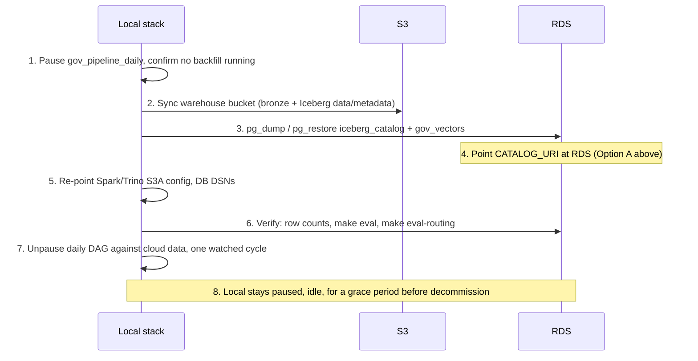

# Cloud Data Cutover — Plan

**Status:** planned, not started · **Written:** 2 Sep 2026 · **Estimate:** ~1–2 evenings,
excluding AWS account setup and a soak period

## Scope

This is not the Phase 11 deployment plan named in `implementation-plan.md`. Phase 11 covers
the whole app — MWAA, EMR Serverless, containerized FastAPI and Next.js, IaC, billing alerts —
and reasonably waits for Phase 8's dashboard to exist. This document covers something narrower
and available today: **the data Phases 0–7 have already produced is portable independent of
whether the dashboard exists yet**, and moving it is a fundamentally different kind of work
than redeploying compute. Nothing here re-harvests or re-embeds anything — every bronze object,
every Iceberg snapshot, every pgvector row already on disk locally is exactly what gets copied.

`phase-7-plan.md`'s **AWS shape** section already named the target services and, critically,
which local pieces are config swaps versus real rewrites. This document doesn't repeat that
table — it picks up from it and answers the question that table deliberately left open: *how do
the actual bytes get from here to there, in what order, verified how, with what rollback?*

**Out of scope, still owned by Phase 11:** MWAA itself, the `EmrServerlessStartJobRunOperator`
rewrite of the Spark submission task, ECS/App Runner for `backend_api`, Next.js hosting,
Terraform/IaC, and billing alerts. Compute keeps running locally (or on a single EC2/ECS host,
per Phase 11's own "cheapest credible target" note) against the migrated data until those are
built.

---

## Why this is safe to do before Phase 8–10

The risk with any one-way migration is committing to it before you trust it. This one isn't
one-way: every step below is a *copy*, not a *move*. Local MinIO and Postgres are untouched
until the very last step, and even then only paused, not deleted. If the cloud side turns out
wrong, reverting means pointing traffic back at the local stack — there is no window where data
exists in only one place until the grace period at the end is deliberately closed out.

---

## What's actually moving

| Local artifact | Where it lives today | AWS target | Mechanism |
| --- | --- | --- | --- |
| Bronze (raw harvested JSON) | MinIO, bucket `warehouse`, prefixes `snapshot/`, `discourse/` | S3, same bucket name and key structure | Object copy |
| Silver (Iceberg data + metadata files) | Same MinIO bucket, under each table's own path | S3, same bucket/keys | Object copy |
| Iceberg catalog (`metadata_location` pointer per table) | Postgres, `iceberg_catalog` database | RDS Postgres, same database — see the open decision below on whether Glue replaces this later | `pg_dump` / `pg_restore` |
| pgvector embeddings + everything else | Postgres, `gov_vectors` database | RDS Postgres, same database | `pg_dump` / `pg_restore` |

The reason the object copy is this mechanical: Iceberg's metadata files record paths like
`s3a://warehouse/gov/proposals/data/....parquet` — bucket-relative, not endpoint-qualified.
The MinIO-vs-real-S3 distinction lives entirely in client config (`fs.s3a.endpoint`), never in
a file's own bytes. Keep the bucket name and key structure identical during the copy and every
existing snapshot, manifest, and data file is still valid the moment the client stops pointing
at MinIO — no Iceberg-side rewrite, no `rewrite_table_path` procedure, no touching history.

---

## Pre-reqs (one-time AWS setup, before any data moves)

- **S3 bucket** — name must be globally unique (unlike MinIO's local `warehouse`), so this is
  the one place the "identical name" rule above needs a decision now, before the copy: either
  claim a real unique name and update `MINIO_BUCKET`/`CATALOG_WAREHOUSE` config to match, or
  accept a differently-named bucket and do a one-time Iceberg metadata path rewrite. Claiming
  the name is less work — do that.
- **RDS for PostgreSQL** — confirm the target engine version ships `pgvector` before
  provisioning (RDS Postgres has supported it since 15.2 / 16.1; pin to one of those or newer).
  Enable the extension once connected: `CREATE EXTENSION IF NOT EXISTS vector;`.
- **IAM role or user** with S3 read/write on the bucket above, scoped to it specifically — not
  broad `s3:*`.
- **Security group / networking** so wherever Trino and the app run (local machine during
  verification, later an EC2/ECS host per Phase 11) can reach the RDS endpoint.
- **Secrets Manager entries** for the RDS credentials and `OPENAI_API_KEY` — `phase-7-plan.md`
  already noted `config/settings.py`'s env-wins-over-`.env` loading needs no code change for
  this.

---

## The catalog: an open decision, worth reconsidering here

`phase-7-plan.md`'s AWS shape table named **Glue** as the Iceberg catalog target. Revisiting
that specifically for this migration, because Trino is staying self-hosted rather than moving
to Athena (the wire-protocol incompatibility already ruled that out) — the reason Glue is
usually attractive, native discovery from Athena and other AWS-native tools, doesn't apply
here. Two real options:

- **A. Keep the existing `iceberg-rest` catalog service, point its `CATALOG_URI` at RDS
  instead of local Postgres.** The `iceberg_catalog` database migrated in step 2 below already
  has the correct `metadata_location` rows — this is a connection-string change, not a
  migration. Spark and Trino's catalog config (a REST URI) doesn't change at all.
- **B. Register each table in Glue**, pointing Glue's entry at the metadata_location already
  copied to S3. Real one-time work — one registration call per table — and only pays off if
  something Glue-native (Athena, other AWS analytics tools) gets added later.

**Recommendation: A.** It's strictly less work, changes nothing about how Spark or Trino
already talk to a catalog, and nothing currently planned needs Glue's native discovery. Revisit
B only if a future phase adds a tool that specifically wants it.

---

## Runbook

1. **Freeze writes.** Pause `gov_pipeline_daily`; confirm no `gov_backfill` run is in flight.
   Copying a moving target risks a torn, inconsistent snapshot — this costs nothing since the
   daily DAG's whole design tolerates being quiet.
2. **Copy bronze + Iceberg data/metadata.** `aws s3 sync` (or `mc mirror` if going MinIO→S3
   directly) from the local `warehouse` bucket to the new S3 bucket, preserving every key.
   Verify with an object count comparison before moving on — a partial sync here is the one
   failure mode this whole plan's "just a copy" safety argument doesn't cover for free.
3. **Migrate both Postgres databases.** `pg_dump iceberg_catalog` and `pg_dump gov_vectors`
   locally, restore into RDS. This is the same dump/restore shape `scripts/restore_fixture.py`
   already exercises for the CI fixture — extending it to point at RDS instead of the local
   isolation stack turns this into a five-minute script, not new work. Create the `vector`
   extension on RDS *before* restoring `gov_vectors`, or the restore fails on the first indexed
   column.
4. **Point the catalog at RDS.** Update the `iceberg-rest` service's `CATALOG_URI` to the RDS
   DSN (Option A above). No Iceberg-side change — the pointer rows already moved in step 3.
5. **Re-point compute config.** Spark and Trino's S3A client config drops the MinIO endpoint
   override and picks up real AWS credentials/IAM instead; app and Airflow task DB connection
   strings move from the local `postgres` service to the RDS endpoint. This step is entirely
   config — no code changes, per `phase-7-plan.md`'s own table.
6. **Verify before trusting anything.** Query the migrated stack directly (Trino or `psql`)
   and compare: bronze object counts, silver row counts per protocol against
   `config/protocols.py`'s documented totals, total embedding count against the local pre-copy
   figure. Re-run `make eval` and `make eval-routing` against the cloud-backed stack — this is
   the direct check that nothing about the copy silently corrupted or dropped rows the
   regression suite would catch. Spot-check a few real citations through the API end to end.
7. **Cut over.** Only after step 6 passes cleanly, unpause the daily DAG against the cloud
   stack and watch one real cycle complete. Confirm the idempotency signal (already-embedded,
   no duplicate work) holds against the migrated data the same way it does locally — this is
   the same three-consecutive-run discipline Phase 7's exit criteria already established, run
   once more here because the underlying storage genuinely changed.
8. **Grace period, then decommission.** Keep the local stack paused but intact for a defined
   window (a few days is enough, given nothing here is a one-way move) as the rollback path.
   Only tear it down — `docker compose down -v` — once the cloud stack has run unattended
   through that window with no surprises.

---

## Rollback

Because every step above is additive to the cloud side and non-destructive to the local side
until step 8, rollback at any point before step 8 is just: stop pointing traffic at the cloud
stack, resume the local `gov_pipeline_daily`. The only state that could exist *only* in the
cloud is whatever the one watched cycle in step 7 wrote — small and known, since it's exactly
one daily run's worth of new content, and content-addressed bronze means re-running that same
window locally afterward doesn't duplicate anything either.

---

## Exit criteria

- Bronze object count, per-protocol silver row counts, and total embedding count match between
  local and cloud, within the expected drift of whatever ran during the freeze-to-cutover
  window.
- `make eval` and `make eval-routing` pass against the cloud-backed stack at parity with the
  last local baseline.
- One full `gov_pipeline_daily` cycle completes against the cloud stack and shows the same
  quiet-day idempotency the local three-consecutive-run test already established.
- Local stack survives the grace period unused, then is deliberately decommissioned — not
  left running indefinitely as an unmonitored second copy.

---

## Risks

| Risk | Severity | Mitigation |
| --- | --- | --- |
| S3 bucket name collision forces a different name than `warehouse`, breaking the "paths are bucket-relative" assumption | Medium | Claim the bucket name during pre-reqs, before any copy — cheaper than a metadata rewrite after the fact |
| RDS Postgres version lacks `pgvector`, or has an older/incompatible version | Low | Confirm engine version supports it at provisioning time, per pre-reqs above, not after the dump/restore |
| Partial or interrupted S3 sync leaves Iceberg metadata referencing files that never arrived | Medium | Explicit object-count verification as its own step, before touching the catalog |
| Writes land during the freeze window despite the pause (a manually triggered backfill, e.g.) | Low | Confirm no `gov_backfill` run is active as part of step 1, not just the daily DAG's pause state |
| Both stacks run during the grace period, doubling infrastructure cost briefly | Low | Grace period is short and bounded by design, not left open-ended |

---

## Cost

| Item | Notes |
| --- | --- |
| S3 storage for the copied bronze + silver | Small — this project's entire corpus is a fraction of a GB at current scale |
| RDS instance | The main recurring cost; a small single-AZ instance is enough for verification and matches Phase 11's "cheapest credible target" framing |
| Data transfer for the initial sync | One-time, small at current corpus size |
| Running both stacks during the grace period | Bounded — local stack is otherwise $0 as it always has been |

---

## What this plan does *not* do

No compute migration (Airflow, Spark submission, Trino hosting, FastAPI packaging) — that
stays Phase 11's job, and nothing here blocks it or needs redoing once it happens. No IaC, no
monitoring/alerting setup, no multi-region or backup strategy beyond RDS's own defaults. This
is deliberately just: get the data that already exists into AWS, prove it's intact, and leave
compute wherever it already runs pointed at the new location.
