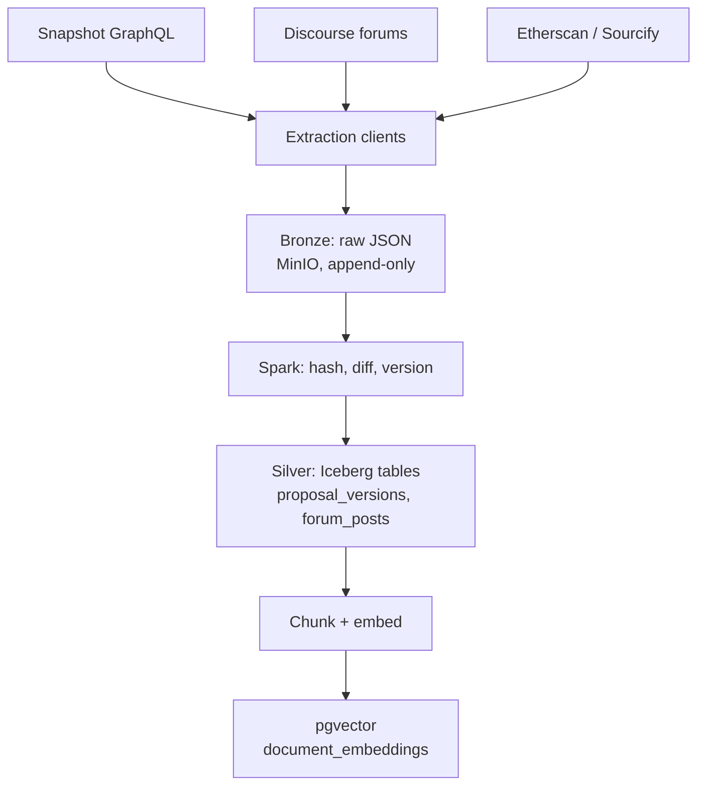
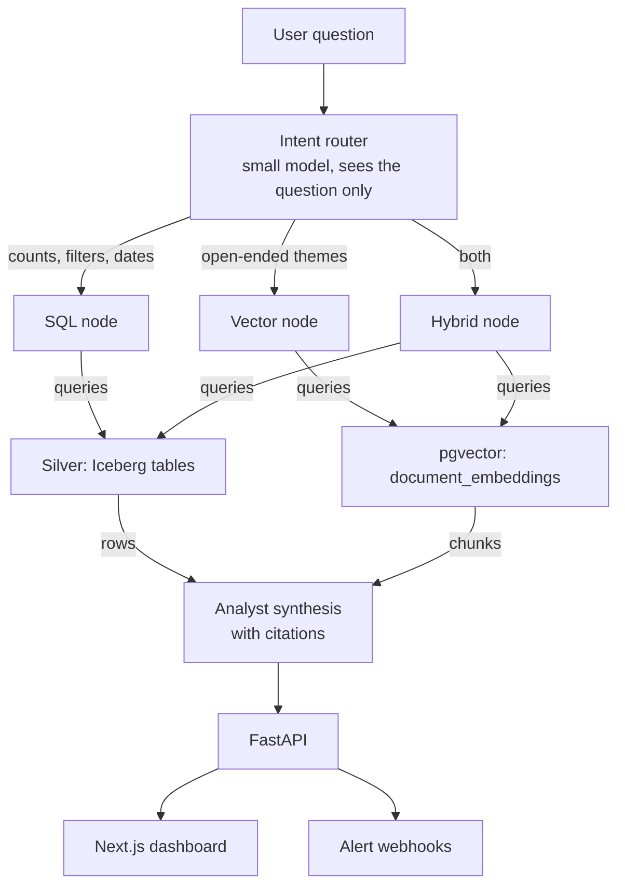

# Crypto Governance Intelligence Platform — Implementation Plan

**Status:** Not started · **Mode:** Portfolio, product-optional · **Drafted:** 12 Aug 2026

A twelve-phase build for a governance monitoring and RAG system across Snapshot, protocol
forums, and on-chain contract source. Every phase runs on a laptop and ends in something you
can show.

---

## Ground rules

**Every phase ends in a demo.** No phase is "done" because the code exists. Each closes with
something you can put on a screen. This is why the plan is sliced vertically rather than
layer-by-layer: the source blueprint's order (storage → ingestion → AI → API) leaves you with
nothing working until the very last step.

**Local first, cloud never required.** Everything except embedding and LLM API calls runs
locally for $0. MinIO stands in for S3, the Iceberg REST catalog for Glue, Airflow standalone
for MWAA. Cloud deploy is Phase 11 and is a *deployment* exercise, not a rewrite.

**The over-engineering is the point — but it isn't the product.** Governance text across every
major DAO is a few gigabytes; Spark, Iceberg and Airflow are machinery for terabytes. For a
portfolio piece that's a defensible choice — the lakehouse *is* the résumé content. But
retrieval quality decides whether it works as a product, so Phase 4 gets an evaluation harness
before any agent code is written.

**Commercial logic stays quarantined.** Auth, tenancy and billing live in
`backend_api/saas_modules/` and are imported nowhere else. The API ships with an open guest
tier so the demo needs no login.

---

## Corrections to the source blueprint

The Google Doc is a reusable template with this project's name applied — the pgvector index in
it is still called `travel_vector_idx`. The concept is sound; the specifics need these fixes
before any of it runs.

| Item | As written | Correction |
| --- | --- | --- |
| Snapshot endpoint | `https://snapshot.org` — the web app, not an API | `https://hub.snapshot.org/graphql` |
| Snapshot query field | Selects `status`, which does not exist | `state`. Also `start`/`end` are Unix ints |
| Iceberg catalog image | `tabulaio/iceberg-rest` — typo, will not pull | `tabulario/iceberg-rest` or `apache/iceberg-rest-fixture` |
| Catalog persistence | Defaults to in-container SQLite; tables vanish on restart | Point `CATALOG_URI` at the Postgres service |
| Spark | Central to the diagram, absent from the compose file | Add it. "Confirm all 4 engines" counts four services, none of them Spark |
| MinIO bucket | No `warehouse` bucket is ever created | Add an `mc` bootstrap init container |
| `workflow.py` | Never calls `.compile()`; edges route to three undefined nodes; no `END` | Write the nodes, add terminal edges, export the compiled graph. As shipped this file raises on import, so the API never starts |
| `AgentState.messages` | A docstring where LangGraph expects a reducer | `Annotated[Sequence[BaseMessage], add_messages]`, or messages overwrite instead of accumulating |
| FastAPI route | `async def` calling synchronous `.invoke()` | `await agent_workflow.ainvoke(...)` — otherwise one request blocks the event loop |
| Snowflake | Sits alongside Iceberg in the diagram | Dropped. Costs money, duplicates the lakehouse at this scale |
| `contract_embeddings` | Named for contracts; only holds proposal and forum text | Renamed `document_embeddings`. Actual contract source arrives in Phase 9 |
| Compose `version:` | `version: '3.8'` | Obsolete under Compose v2 — remove the key |

### The correction that matters most

Iceberg time travel answers *"what did this table look like at snapshot X"* — not *"what did
proposal ABC say on March 3rd."* Those coincide only if the pipeline overwrites rows, leaving
old bodies recoverable solely from prior table snapshots. That's fragile: `expire_snapshots`
exists precisely because metadata accumulates, and its default retention is five days, so
routine housekeeping becomes a data-loss event.

Document history belongs in the rows, as validity windows. Iceberg then does what it's
genuinely good at — ACID commits, pipeline rollback, schema evolution — and stops being
load-bearing for the archive.

---

## Architecture

Bronze holds raw API responses forever and is the replay source. Silver holds versioned
documents. The vector store is a derived index that can be rebuilt from silver at any time.

Two independent flows. Ingestion runs on a schedule and only writes; query answering runs
on demand and only reads. Drawing them as one graph invites the mistake of thinking data
flows *into* the router, which it does not.

### Ingestion — scheduled, write path



### Query answering — on demand, read path



**The router reads the question and nothing else.** It emits one of three labels — SQL
against silver for counts, filters and dates; vector search for open-ended thematic
questions; a hybrid pass for questions blending precise constraints with qualitative
judgment. Only after that decision does an execution node touch a data store, and only the
*results* reach the analyst.

That direction is the whole point of having a router. It stays cheap precisely because it
never reads the corpus — a router needing data in order to decide how to fetch data would
be both circular and expensive.

---

## Data model

Two changes from the blueprint carry most of the weight: explicit row-level versioning in
silver, and model provenance on every embedding.

### Silver — versioned documents

Slowly-changing-dimension Type 2. A new row is written only when `content_hash` changes, so
re-scraping unchanged proposals costs nothing. "The proposal as of T" becomes an ordinary
predicate that survives compaction.

```sql
CREATE TABLE IF NOT EXISTS silver.proposal_versions (
    proposal_id       STRING    NOT NULL,
    protocol_name     STRING    NOT NULL,
    source            STRING    NOT NULL,   -- 'snapshot' | 'tally'
    content_hash      STRING    NOT NULL,   -- sha256(title || body)
    title             STRING,
    body              STRING,
    proposer_address  STRING,
    proposal_state    STRING,               -- pending | active | closed
    voting_start      TIMESTAMP,
    voting_end        TIMESTAMP,
    observed_at       TIMESTAMP NOT NULL,
    valid_from        TIMESTAMP NOT NULL,
    valid_to          TIMESTAMP,            -- NULL = current
    is_current        BOOLEAN   NOT NULL
)
USING iceberg
PARTITIONED BY (protocol_name)
TBLPROPERTIES (
    'format-version' = '2',
    'write.parquet.compression-codec' = 'zstd'
);
```

`forum_posts` mirrors this shape keyed on `(forum_host, topic_id, post_id)`. Discourse exposes
native revision history, so post edits are recoverable from the source rather than inferred.

### Vector store — model provenance

The blueprint's schema makes an embedding-model swap a truncate-and-pray operation with no way
to compare old and new. Two columns fix that: `embedding_model` lets both models' vectors
coexist so you can A/B retrieval before cutting over, and `source_content_hash` joins each
chunk back to the exact document version it came from.

```sql
CREATE EXTENSION IF NOT EXISTS vector;

CREATE TABLE IF NOT EXISTS document_embeddings (
    chunk_id             UUID PRIMARY KEY DEFAULT gen_random_uuid(),
    proposal_id          VARCHAR(255) NOT NULL,
    protocol_name        VARCHAR(100) NOT NULL,
    source_content_hash  VARCHAR(64)  NOT NULL,
    chunk_type           VARCHAR(50)  NOT NULL,  -- proposal_body | forum_post | contract_source
    chunk_index          INT          NOT NULL,
    text_chunk           TEXT         NOT NULL,
    embedding_model      VARCHAR(100) NOT NULL,
    embedding            VECTOR(1536) NOT NULL,
    valid_from           TIMESTAMPTZ  NOT NULL,
    valid_to             TIMESTAMPTZ,
    created_at           TIMESTAMPTZ  DEFAULT now(),
    UNIQUE (source_content_hash, chunk_index, embedding_model)
);

CREATE INDEX IF NOT EXISTS document_embeddings_hnsw_idx
    ON document_embeddings USING hnsw (embedding vector_cosine_ops);
CREATE INDEX IF NOT EXISTS document_embeddings_lookup_idx
    ON document_embeddings (protocol_name, proposal_id, embedding_model);
```

**Two constraints to design around now:**

- **HNSW refuses more than 2000 dimensions.** Verified against pgvector 0.8.6:
  `ERROR: column cannot have more than 2000 dimensions for hnsw index` (SQLSTATE 54000).
  `VECTOR(3072)` is therefore not "a wider column" — it is an unindexable one, and every
  similarity query degrades to a sequential scan. The workaround is `halfvec` (float16),
  whose ceiling is 4000, and which occupies exactly the same bytes as `vector(1536)`
  (3072 × 2 == 1536 × 4). Measured at 20k rows: 159 MB heap+TOAST / 81 MB index for
  `halfvec(3072)` against 159 MB / 91 MB for `vector(1536)`.
- **Prefer narrowing the model to widening the column.** `text-embedding-3` models are
  Matryoshka-trained, so requesting `dimensions=1536` from the larger model beats the
  smaller model at the same width while staying under the ceiling. Embedding APIs bill per
  token, not per dimension, so a narrower vector costs the same to produce.
- **Never search across models.** Vectors from different models share no coordinate space, so
  every query must carry `WHERE embedding_model = $1`. Consider per-model partial indexes once
  a second model exists.
- **Raise `maintenance_work_mem` before the first backfill.** An HNSW build that exceeds it
  falls back to a much slower on-disk build. The 64 MB default already warns at 20k rows;
  the stack now runs at 512 MB.

**Point-in-time retrieval.** Because `valid_from`/`valid_to` ride on the embeddings too, the
agent can be asked historical questions without retrieving today's text and citing it as
March's. Skipping this makes for a subtle and fairly ugly failure mode later.

---

## Build phases

### Phase 0 — Repo skeleton and toolchain
*Local · ~2 hrs*

Directory layout from the blueprint (it's a good layout), `pyproject.toml`, `.env.example` with
no real secrets, `Makefile` targets, `ruff` + `pytest`, and a GitHub Actions workflow that lints
and tests. Initialize git — the working directory currently isn't a repo.

- **Demo:** `make test` passes and the CI badge is green on an empty test suite.
- **Exit criteria:** Clean clone → `make install && make test` works on a fresh machine.

### Phase 1 — Infrastructure that actually boots
*Local · ~1 evening*

The corrected Compose stack, with healthchecks on every service so "all green" means something:

| Service | Image | Role |
| --- | --- | --- |
| `postgres` | `pgvector/pgvector:pg16` | Three databases: vectors, Iceberg catalog, Airflow metadata |
| `minio` | `minio/minio` | S3-compatible object store |
| `minio-init` | `minio/mc` | Creates the `warehouse` bucket, then exits |
| `iceberg-rest` | `tabulario/iceberg-rest` | Catalog, backed by Postgres for persistence |
| `spark` | `apache/spark:3.5.x` | Local mode to start; master + worker only if you want the cluster screenshot |

Start Spark in local mode. A single-node master/worker pair looks better in a screenshot but
adds moving parts you'll debug instead of building; it's a ten-minute change to add in Phase 7.

- **Demo:** `docker compose up` reports every service healthy. Create an Iceberg table from
  `spark-sql`, `docker compose restart`, query it again — the data is still there.
- **Exit criteria:** Catalog metadata survives a full stack restart. This is the specific
  failure the blueprint's config would have hit.

### Phase 2 — Ingestion, no AI involved
*Local · ~1–2 evenings*

Snapshot GraphQL client against the correct endpoint, Discourse REST client (`/latest.json`,
`/t/{id}.json`, and the revisions endpoint), both writing raw unmodified responses to bronze in
MinIO, partitioned `source/space/ingest_date/`. Object keys carry a content hash so re-runs are
natural no-ops.

Build in a token-bucket rate limiter and exponential backoff from the start rather than
retrofitting them after the first 429. Run it from a plain CLI script — no Airflow yet.

- **Demo:** Open the MinIO console at `localhost:9001` and browse real Aave and Uniswap
  proposals as JSON, fetched minutes ago.
- **Exit criteria:** Running the harvest twice produces zero duplicate bronze objects, and a
  429 from either source is retried rather than fatal.

### Phase 3 — Lakehouse with real version history
*Local · ~2 evenings*

The PySpark job: read bronze, compute `content_hash`, compare against current rows, and close
out plus append only where content actually changed. Write `proposal_versions` and `forum_posts`
as Iceberg tables.

Worth knowing while building: Snapshot proposal bodies are pinned to IPFS and effectively
immutable, so most version churn there comes from state and vote-count changes. Discourse posts
genuinely get edited, and that's where the SCD2 machinery earns its keep.

- **Demo:** A SQL query showing a forum post that was edited — both versions side by side with
  their validity windows. Then the same query with an `AS OF` timestamp returning only what was
  true that day.
- **Exit criteria:** Idempotent across three consecutive runs, and a point-in-time query returns
  the correct historical version.

### Phase 4 — Retrieval and the evaluation harness
*Local · API cost · ~2–3 evenings*

Chunking (start with structure-aware splitting on markdown headings — governance posts are
heavily sectioned — falling back to token windows), embedding, and loading into
`document_embeddings`. Then a plain `search(query, k) → chunks` function with no agent anywhere
near it.

Before that function exists, hand-write twenty questions against proposals you've actually read,
each labelled with the documents that ought to come back. Measure recall@5 and record the number.

> **Don't skip the eval set.** It is the only instrument that tells you later whether the agent
> is improving or merely changing. Every subsequent phase adds indirection between your query
> and the retrieved chunk; without a baseline recorded here, regressions become invisible and
> you end up tuning prompts by vibes.

- **Demo:** `gov search "How do DAOs try to reduce reliance on a small number of large
  delegates?"` returns ranked chunks with protocol, proposal and date. The eval script prints
  a recall@5 figure.

  > This demo query was originally `"delegate voting power concentration"`. When the CLI was
  > built and the demo actually run, that query returned **nothing** — best distance 0.551
  > against a 0.48 ceiling. It is not a bug: the corpus has material adjacent to the topic
  > but no document about it, and its nearest hit is further away than every deliberately
  > unanswerable question in the eval set. The threshold declining to bluff is the correct
  > behaviour. Kept here because a demo query written before the corpus existed, and never
  > run until exit, is a mistake worth remembering. See `docs/phase-4-retrieval.md`.

- **Exit criteria:** A baseline recall number is committed to the repo. It doesn't need to be
  good yet — it needs to exist.

### Phase 5 — LangGraph agent and intent router
*Local · API cost · ~2 evenings*

Now the agent goes on top of retrieval you already trust. Proper `add_messages` reducer on
state; router node; the three execution nodes the blueprint referenced but never wrote; a
synthesis node carrying the analyst prompt; terminal edges; a compiled graph exported for import.

The analyst prompt from the doc is genuinely good — the three-dimension structure (technical,
economic, political) and the explicit `DATA GAP IDENTIFIED` escape hatch are both worth keeping
verbatim. Enforce inline citations structurally by making chunk IDs part of the model's output
contract rather than trusting the instruction.

- **Demo:** A terminal chat answering "which Aave proposals in the last quarter changed risk
  parameters, and what did the forum argue about them?" — with citations that resolve to real
  chunks.
- **Exit criteria:** The router selects the correct branch on ≥80% of a fifteen-query routing
  test set, and every factual claim carries a resolvable citation.

> **Working product from here.**

### Phase 6 — FastAPI delivery layer
*Local · ~1 evening*

Thin layer over Phase 5: `/api/v1/chat` using `ainvoke`, SSE streaming so the UI can render
tokens as they arrive, `/proposals` for list and detail, and a real `/health` that checks
Postgres and the catalog rather than returning a constant. Keep the blueprint's guest-tier
fallback so the demo needs no key.

- **Demo:** The auto-generated Swagger page at `/docs`, driving a live query end to end.
- **Exit criteria:** Ten concurrent requests don't serialize — the async path is genuinely async.

### Phase 7 — Airflow orchestration
*Local · ~1–2 evenings*

Only now, wrapping scripts that already work. DAGs for harvest → transform → embed, with
Postgres as the metadata database and `LocalExecutor` instead of the blueprint's SQLite-backed
`SequentialExecutor`. Build a custom image — the stock Airflow image has neither `requests` nor
`pyspark`, so the DAGs would fail at import.

Scheduling is deliberately late. The blueprint puts it near the front, which means debugging DAG
plumbing before you know whether the underlying jobs work.

- **Demo:** The Airflow UI with a week of green daily runs, and a Gantt view showing where
  pipeline time actually goes.
- **Exit criteria:** Full pipeline runs unattended for three consecutive days.

### Phase 8 — Next.js dashboard
*Local · ~3–4 evenings*

Four screens: proposal list with protocol and status filters; proposal detail with the risk
panel; chat with streaming and clickable citations; and a version-history timeline for a single
proposal.

That last one is the screen worth building carefully. It's the only place the SCD2 and lakehouse
work becomes *visible* — a reviewer can see time travel rather than take your word for it.

- **Demo:** The screenshot that goes in the portfolio.
- **Exit criteria:** Runs against the local API with no mocked data anywhere.

### Phase 9 — Smart contract source ingestion
*Local · ~2 evenings*

Extract contract addresses from proposal bodies and execution payloads, fetch verified source
from Etherscan or Sourcify, chunk by function, and embed as `chunk_type = 'contract_source'`.
Diff against the currently deployed implementation where the proposal is an upgrade.

This is the piece the blueprint promises in its title and never delivers. It's genuinely
optional for a working demo — but "governance monitoring that reads the actual contract diff"
is a much stronger claim than "RAG over forum posts," and it's the part a crypto-native reviewer
will look for.

- **Demo:** The agent answering a question about the Solidity a proposal would actually deploy,
  citing specific functions.
- **Exit criteria:** For a known upgrade proposal, the system surfaces the changed functions
  without being told where to look.

### Phase 10 — Alerting
*Local · ~1 evening*

An Airflow task that scores newly-detected proposals and fires a Discord or Slack webhook above
a risk threshold. Deduplicate on `(proposal_id, content_hash)` so a re-scrape never re-alerts.

- **Demo:** A real alert arriving in Discord for a real proposal, minutes after it went live.
- **Exit criteria:** Seven days running with zero duplicate alerts.

### Phase 11 — Cloud deployment
*Cloud · ~3–5 evenings*

Because every component was chosen to have a managed twin, this is configuration rather than
redesign: MinIO → S3, Iceberg REST → Glue or a hosted catalog, Spark → EMR Serverless, Airflow →
MWAA or a small always-on VM, Postgres → RDS with the `vector` extension, FastAPI and Next.js →
containers on Fly.io, Render, or ECS.

For a portfolio deployment the cheapest credible target is a single small VM running the compose
stack, plus managed Postgres, plus a scheduled job runner. Full managed-service parity is the
expensive version and only worth it if you're demonstrating cloud architecture specifically.

The data half of this doesn't have to wait for Phase 8–10 to exist — `docs/cloud-cutover-plan.md`
scopes moving the bronze/silver/embeddings already built by Phase 7 into S3 and RDS on its own,
leaving compute (this phase's actual remaining scope) pointed at the migrated data whenever it's
ready to move.

- **Demo:** A public URL you can put on a résumé.
- **Exit criteria:** Deploy reproducible from IaC, documented monthly cost ceiling, billing alerts.

### Phase 12 — Commercial modules
*Deferred*

Not now — listed so earlier phases stay compatible. Multi-tenant JWT auth, per-tenant row
filtering, Stripe billing and tier gates, usage metering on LLM spend. The isolation discipline
from Phase 0 keeps this from becoming a rewrite.

The load-bearing question before any of this is whether tenancy is row-level or schema-level in
Postgres. Deciding it early costs nothing; deciding it late costs a migration.

- **Exit criteria:** Not scheduled. Revisit only if someone offers money.

---

## The fast path

If you want something impressive in a week rather than a month:

Run **0 → 2 → 4 → 5**, skipping MinIO, Spark and Iceberg entirely — land raw JSON on local disk
and put silver in plain Postgres tables with the same SCD2 columns. That gets you a working
governance Q&A system in roughly four evenings.

Phases 1 and 3 then retrofit underneath without touching the agent, because the SCD2 schema is
identical in either store. You lose nothing by starting this way, and you learn early whether
retrieval quality justifies the rest of the build.

The tradeoff is honest: the lakehouse is the data-engineering credential, so skipping it
permanently weakens the portfolio claim. Skipping it *temporarily* costs nothing.

---

## Cost

| Item | Phase | Notes |
| --- | --- | --- |
| Local infrastructure | 1–10 | $0. Budget ~8 GB of Docker memory for Spark + Airflow + Postgres |
| Embeddings | 4 | One-time per chunk, then only on new or changed documents. The dominant cost is the initial backfill; a model swap re-runs the whole thing, which is exactly why `embedding_model` exists |
| LLM calls | 5–10 | Per query. The router deliberately uses a small cheap model; only synthesis needs a strong one |
| Etherscan API | 9 | Free tier is adequate at this volume |
| Cloud hosting | 11 | Single VM plus managed Postgres is the cheap credible option; full managed parity is several times that |

Check current published rates rather than trusting any figure quoted in a plan document —
pricing moves. Set a hard spend cap on the API key before Phase 4, since that's the first phase
that can loop.

---

## Risks

| Risk | Severity | Mitigation |
| --- | --- | --- |
| Snapshot rate limits or API changes | High | Bronze layer means you never re-fetch what you already have. Pin the client behind an interface so an API change touches one file |
| Discourse forums vary and some restrict scraping | High | Every protocol runs its own instance with its own limits and terms. Read them per forum; treat ingestion reliability as first-class, not plumbing |
| Retrieval quality disappoints | High | Phase 4's eval set surfaces this in week one rather than after the UI is built |
| Local resource exhaustion | Medium | Spark in local mode, not a cluster. Compose profiles so you can run subsets |
| Snapshot expiry destroys history | Medium | Already mitigated by row-level versioning — the reason that design choice matters |
| Scope creep across chains | Medium | Three to five protocols on one chain until Phase 8 ships |
| LLM cost drift | Low | Hard caps on the key; cache embeddings by content hash |

---

## Open decisions

Four things worth settling before Phase 2. None block starting Phase 0 or 1.

**Embedding model — settled 14 Aug 2026.** `text-embedding-3-large` with `dimensions=1536`.
This takes the stronger model while staying under pgvector's 2000-dimension index ceiling, so
`VECTOR(1536)` stands as built and Phase 4 needs no migration. If the eval set later favours
full 3072, the path is a `halfvec(3072)` column at identical storage cost, with
`embedding_model` letting both coexist during the comparison. Note that if you want the
analyst node on Claude, you still need OpenAI or Voyage for the vectors — Anthropic doesn't
offer an embeddings API.

**Initial protocol coverage.** Suggest three to five Ethereum-ecosystem protocols with both
active Snapshot spaces and busy Discourse forums — Aave, Uniswap, Arbitrum, Optimism, Compound.
Enough variety to prove the system generalizes, few enough to stay debuggable.

**Analyst model.** The blueprint uses `gpt-4o-mini` for routing, which is the right instinct —
routing is cheap, synthesis is not. Whether synthesis runs on OpenAI or Claude is a swap of one
client, so this can stay undecided until Phase 5.

**Cloud target — settled 27 Aug 2026.** AWS. This was flagged as shaping "whether Phase 7 uses
Airflow-the-product or something MWAA-compatible" — it does, and `docs/phase-7-plan.md`'s AWS
section works through the consequence in detail: most of Phase 7's design ports to Amazon MWAA
as configuration, except the Spark-submission step (local `docker exec` into a sibling
container has no equivalent in a managed, serverless environment, and needs a real rewrite to
`EmrServerlessStartJobRunOperator` at Phase 11). Full deployment specifics — Terraform, IAM,
VPC layout, actual cost comparison — remain Phase 11's job; this only records the target so
Phase 7 doesn't design around an assumption Phase 11 would have to undo.

---

*Sequencing and corrections derived from the original blueprint document. Phase estimates assume
evening-sized sessions and will drift — the exit criteria matter more than the hours.*
