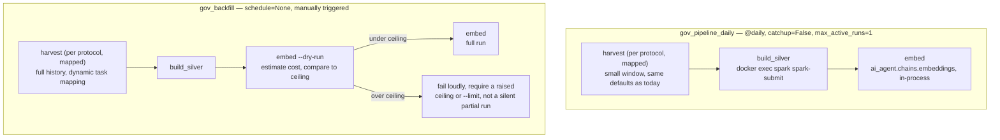

# Phase 7 — Airflow Orchestration

**Status:** planned, not started · **Written:** 27 Aug 2026 · **Estimate:** ~2–3 evenings local,
plus a separate AWS cutover pass at Phase 11

Phases 2–4 built three scripts that already work on their own: `data_pipeline.harvest`
(bronze), `build_silver.py` (silver), `ai_agent.chains.embeddings` (pgvector). Phase 7 does not
change what any of them do — it puts a scheduler in front of them, wraps them in a DAG so
"harvest → silver → embed" is one dependency graph instead of three commands run by hand, and
adds the piece nothing before this phase has needed: a **full historical backfill**, not just
the ~20-proposal, ~15-topic-per-protocol slices every phase so far has demoed against.

---

## Why this is later than the source blueprint puts it

The original blueprint puts scheduling near the front of the build. This project's plan
already corrected that once, in the ground rules: *"scheduling is deliberately late... the
blueprint puts it near the front, which means debugging DAG plumbing before you know whether
the underlying jobs work."* Phase 7 is where that IOU comes due. Every script it orchestrates
has already been run, measured, and fixed in isolation — the harvester's rate limiter has real
unit tests against injected clocks, the Spark job's idempotency was proven by a snapshot-log
bug it caught in Phase 3, and the embeddings loader has its own dry-run mode. Nothing here is
debugging extraction logic and DAG plumbing at the same time.

---

## What Phase 7 actually is

Two DAGs, not one, because "run the pipeline on a schedule" and "backfill history" are
different shapes of problem with different failure modes and different costs:

1. **`gov_pipeline_daily`** — scheduled, small, idempotent by construction. Harvests a recent
   window across all five protocols, folds it into silver, embeds what changed. Most days this
   should do almost nothing, because bronze is content-addressed, silver's MERGE is
   change-guarded, and the embeddings loader skips what's already there — a quiet DAG run is
   the **expected**, healthy outcome, not a bug to investigate.
2. **`gov_backfill`** — manually triggered, parameterized, expensive relative to the daily run.
   Pulls each protocol's full history rather than a recent slice, then a full silver build and
   embed. This is what the plan's Phase 9/Phase 8 documents have been waiting on: the Phase 6
   results doc named it directly — *"the full historical backfill belongs in Phase 7, not Phase
   8"* — because Phase 8's version-history timeline screen needs real multi-version documents
   to show, and none exist yet. Every entity harvested so far is single-version.

Plus the piece that makes both trustworthy: **real dependency ordering and real failure
visibility**, which a cron job calling three scripts in sequence does not give you for free —
a mid-pipeline failure needs to stop the pipeline at that point, be visible without reading
logs by hand, and retry sanely rather than either silently continuing on stale data or paging
someone at 3am for a transient 503.

---

## What's already provisioned, and one correction to the blueprint's own reasoning

**The `airflow` Postgres database already exists.** `docker/postgres/init/00-create-databases.sh`
has created it since Phase 1 — *"Three databases: vectors, Iceberg catalog, Airflow
metadata"* was written into the plan before Phase 1 was built, and Phase 1 followed through.
Phase 7 needs no schema migration to get a metadata store; it needs Airflow itself pointed at
what's already there.

**The blueprint's stated reason for a custom image doesn't hold the way it assumed.** The
implementation plan says: *"Build a custom image — the stock Airflow image has neither
`requests` nor `pyspark`, so the DAGs would fail at import."* The `requests` half is right.
The `pyspark` half assumes DAG tasks run Spark **in-process**, inside the Airflow container,
via something like `SparkSubmitOperator` calling a local `pyspark`. That is not how this
project's Spark step actually works: `make silver` runs `docker compose exec -T spark
spark-submit ...` **against the already-built, Iceberg-jar-loaded `crypto-gov/spark-iceberg`
image** — a completely separate container that already exists and already has the 267MB of
Hadoop/AWS/Iceberg jars baked in. Duplicating all of that inside the Airflow image just to run
`pyspark` there too would be pure waste. Phase 7's DAG shells out to the existing spark
container the same way the Makefile already does, so the custom Airflow image needs `requests`,
this project's own package (`pip install -e .`, for the embeddings step to import
`ai_agent.chains.embeddings` directly), and the `docker` CLI — not `pyspark`, not the Iceberg
jars.

---

## Architecture

### The two DAGs, task by task

**`gov_pipeline_daily`**

| Task | Operator | What it runs |
| --- | --- | --- |
| `harvest_<protocol>` × 5, mapped | `BashOperator` | `python -m data_pipeline.harvest --protocol {p} --proposals 20 --topics 15 --with-posts` — the exact defaults every phase has demoed against |
| `build_silver` | `BashOperator` | `docker compose -p crypto-gov exec -T spark spark-submit --master "local[*]" /opt/app/data_pipeline/transformation/build_silver.py` |
| `embed` | `PythonOperator` | calls `ai_agent.chains.embeddings.main([])` in-process — no docker exec needed, since this is plain Python already runnable inside the Airflow container |

Dynamic task mapping (`.expand()` over the five `Protocol` entries in `config/protocols.py`)
rather than five hardcoded task ids: adding a sixth protocol to `config/protocols.py` should
not require touching the DAG file, the same way it doesn't require touching `harvest.py`
today.

**`gov_backfill`** — same shape, three differences:

- `harvest_<protocol>` runs with `proposals` and `topics` taken from the DAG run's `params`
  (a `dagrun.conf` dict), not hardcoded — see *Sizing the backfill*, below, for what to pass.
- Before the real `embed` task, an `embed_dry_run` task runs `ai_agent.chains.embeddings.main
  (["--dry-run"])`, parses the reported token count, multiplies by a per-token rate read from
  an Airflow Variable (`embedding_cost_per_1k_tokens`, set once and updated when pricing
  changes — never hardcoded into the DAG, per the project's existing "check current published
  rates" discipline), and compares the result against another Variable
  (`backfill_cost_ceiling_usd`).
- If the estimate exceeds the ceiling, the DAG **fails that task with the estimate in the
  log** rather than embedding a truncated, arbitrary subset. A human raises the ceiling
  (deliberately, in the Airflow UI) or re-triggers with a smaller `params.topics`. This is the
  same "hard spend cap" instinct Phase 4 already established, moved from "a cap on the API key"
  to "a cap the pipeline itself checks before spending," which a backfill — the one thing in
  this project big enough to run up a real bill — specifically needs and the daily DAG does not.

### Why `docker exec`, and what it costs

Running `build_silver` from Airflow means the container that executes the task (with
`LocalExecutor`, that's the **scheduler** container — LocalExecutor runs tasks as subprocesses
of the scheduler process, so there is no separate "worker" service to reach for) needs to
issue Docker commands against sibling containers. That requires mounting the host's
`/var/run/docker.sock` into the scheduler container and installing the `docker` CLI there —
the standard "Docker-outside-of-Docker" (DooD) pattern.

**This is worth being honest about rather than glossing over:** mounting the Docker socket
gives that container root-equivalent control over the whole Docker host. Fine for a local,
single-user demo stack; not a pattern to carry into any shared or production environment
without much tighter controls (a Docker socket proxy, at minimum). It is also, not
coincidentally, exactly the kind of thing that **cannot** carry to AWS — see the AWS section
below, where this is precisely the seam that has to change shape, not just configuration.

**Alternative considered and rejected for now:** Airflow's `DockerOperator` spinning up a
fresh, short-lived container from the `crypto-gov/spark-iceberg` image per task run, attached
to the `crypto-gov` compose network, instead of `exec`-ing into the long-lived sleeping `spark`
service. This is arguably more idiomatic (closer to what `KubernetesPodOperator` does in a
cluster setting) and worth revisiting if the sleeping-container pattern becomes awkward — but
it still needs the same Docker socket mount, so it does not change the security posture, and
it is more moving parts for no measured benefit today. `docker compose exec` matches what
`make silver` already does, which is the smaller change.

---

## Sizing the historical backfill

`config/protocols.py` documents known proposal counts: Aave ~970, Uniswap ~197, Arbitrum
~415, Optimism ~93, ENS ~98 — **~1,773 proposals total.** Fetching that many is cheap in
request terms: `SnapshotClient.fetch_proposals` paginates 50 at a time on a cursor, so even
Aave's ~970 is ~20 GraphQL requests. At the harvester's self-imposed 60 requests/minute, that's
under a minute of actual throttled wait per protocol — the backfill's wall-clock time is not
bounded by Snapshot at all.

**Forum topic counts are not documented anywhere in this repo, and that's a real gap worth
naming rather than papering over with an invented number.** `config/protocols.py`'s own
docstring only ever quotes Snapshot proposal counts. Discourse's `/latest.json` doesn't expose
a "total topics" figure the way Snapshot's `Space` query exposes `proposalsCount`, and nobody
has queried it. With `--with-posts`, each topic costs one detail request beyond the listing
page, at 30 requests/minute **per host** — a forum with 500 active topics costs roughly 17
minutes of throttled requests, and five protocols' Discourse harvests run against five
independent hosts with five independent token buckets (`harvest.py` already gives each
protocol "a fresh bucket per host"), so if the DAG fans these out as five mapped tasks running
concurrently, total wall-clock time is bounded by the **busiest single forum**, not the sum of
all five.

**The completeness signal to use instead of a guessed target number:** `harvest.py` already
reports written-vs-unchanged counts per run. Run the backfill once with a generous `topics`
figure (start at, say, 500–1000 per protocol — cheap to raise, since bronze is
content-addressed and a second, larger run only fetches what the first one didn't reach); if
the written count is still climbing steeply relative to unchanged, that protocol's forum has
more history than the run reached and the DAG should be re-triggered with a larger `topics`
value for that protocol specifically. When a run comes back mostly "unchanged" against the
prior large run, that protocol's history has been reached. This is an operational signal the
tooling already exposes, not new machinery.

**Estimating embedding cost before spending it.** Phase 4's actual, measured baseline was
1,655 chunks / 419,826 tokens billed / ~$0.055, for a corpus built from the current small
per-protocol slices (~100 proposals + ~75 topics total across five protocols). A full backfill
across ~1,773 proposals plus a plausibly much larger forum corpus could easily be one to two
orders of magnitude bigger — this document will not invent a precise dollar figure, because
the project's own convention is explicit about this: *"Check current published rates rather
than trusting any figure quoted in a plan document — pricing moves."* What Phase 7 adds is
`make embed ARGS=--dry-run`'s token count wired into the `embed_dry_run` task's cost-ceiling
check described above, so the estimate is computed from the real corpus at backfill time, not
guessed at plan-writing time.

---

## How we will know it works

Two separate things need separate evidence — a scheduled pipeline that behaves well
indefinitely, and a one-time backfill that actually completes. Neither is "the DAG turned
green once."

### The ongoing scheduled pipeline

**Look for:**

- A week of daily runs in the Airflow UI's Grid view, all green, with no manual
  intervention — a stronger bar than the plan's original exit criterion ("three consecutive
  days"), settled on because a week crosses at least one weekend and one day where a protocol's
  forum might legitimately have zero new activity, which is exactly the case that must **not**
  look like a failure.
- The Gantt view showing where time actually goes across a run — the plan's original demo
  line, kept because it's the only view that would show, for instance, one Discourse host being
  slow relative to the others.
- **Quiet days look quiet.** A daily run against unchanged upstream content should show near-
  instant `harvest` tasks (all "unchanged", per the existing CLI's own reporting), a
  `build_silver` log line reading `no changes, MERGE skipped` for both tables (the exact
  message Phase 3's guarded merge already prints), and an `embed` task reporting `nothing to
  embed — everything is current`. A daily run that takes as long as a fresh harvest every
  single day, with no new governance activity to explain it, means idempotency broke somewhere
  in the chain — this is the single most important thing to watch, because it's also the
  quietest possible failure: nothing errors, the DAG stays green, and only the run duration
  and the API bill say something is wrong.
- A deliberately broken run (kill a Discourse host's reachability, or point the DAG at a bad
  Snapshot space for one protocol) retries per the configured policy and then **fails visibly**
  — a red task in the UI with the real exception in the task log — rather than the DAG marking
  itself successful having silently skipped a protocol. `harvest.py`'s existing per-protocol
  `try/except` already prevents one protocol's failure from aborting the others; the DAG task
  wrapping it must not swallow that signal into a `0` exit code when `report.failures` is
  non-empty. (It doesn't today — `main()` already returns `1` when
  `report.snapshot.errors or report.discourse.errors` — the DAG task just needs to actually
  fail on a non-zero exit rather than treat any exit as success.)

**Test:**

| Test | What it guards |
| --- | --- |
| `tests/test_phase7_dags.py::test_dags_import_without_error` | the LangGraph-workflow lesson from Phase 5, applied to Airflow: a DAG file that raises on import is a DAG that silently never runs, and `docker compose ps` would still show the scheduler healthy |
| `test_gov_pipeline_daily_has_the_expected_task_dependencies` | asserts `harvest_* → build_silver → embed`, so a copy-paste edit to the DAG can't silently detach a task from the graph |
| `test_gov_pipeline_daily_does_not_catch_up_and_runs_one_at_a_time` | asserts `catchup=False` and `max_active_runs=1` on the DAG object — the two settings that stop "the scheduler was down for three days" from becoming three simultaneous, mutually-clobbering harvests |
| `test_harvest_task_fails_the_dag_on_reported_errors` | asserts the BashOperator's command construction surfaces `harvest.py`'s exit code rather than absorbing it — the exact "quiet failure" risk named above |
| `test_every_protocol_is_represented_in_the_mapped_tasks` | mirrors the same intent as Phase 3's "a space quietly missing from silver looks identical to a space with no activity" finding — a protocol silently dropped from the DAG's mapping must be caught by a test, not discovered months later |
| `airflow dags test gov_pipeline_daily <date>` (manual / CI, not pytest) | runs the real DAG against the real stack without needing the scheduler+webserver+triggerer all live — the fastest way to prove the wiring actually executes before waiting on a real week of cron runs |
| Run `airflow dags test gov_pipeline_daily` for **three different logical dates in a row** against the same stack | the closest automatable proxy for "three consecutive days unattended" — asserts bronze object counts, silver row counts, and embedding row counts after the second and third runs show the idempotent, quiet-day pattern above, not linear growth |

### The historical backfill

**Look for:**

- Silver's `proposal_versions` current-row count per protocol approaching the documented
  figures in `config/protocols.py` (Aave ~970, Uniswap ~197, Arbitrum ~415, Optimism ~93, ENS
  ~98) — "approaching," not "exactly matching," since those figures are themselves
  point-in-time notes from 14 Aug 2026 and real governance activity has continued since.
- **At least one entity with more than one version in silver.** This is the concrete, testable
  payoff the whole phase is partly justified by: Phase 3's exit demo could not show a
  before/after edit because none existed yet (*"the gap in the demo"*), and Phase 5's
  integration suite has an explicit, honestly-worded skip — `test_is_current_matters_or_says_
  why_it_cannot_be_shown` — that only stops skipping once silver holds a superseded row. A
  successful backfill, run twice with enough time between runs for at least one vote count or
  one forum edit to occur, should finally turn that skip into a real pass.
- The `embed_dry_run` task's logged token estimate and dollar estimate, followed by the actual
  billed token count from the real `embed` run's own output — close enough between the two to
  trust the estimator for the next backfill, and recorded in the DAG run's logs the same way
  Phase 4 recorded its baseline in `tests/eval/baseline.json`.
- `make eval` and `make eval-routing`, re-run against the larger corpus, showing the fitted
  Phase 4 relevance thresholds either still hold or need re-fitting — this is exactly the
  "threshold drift as the corpus grows" concern already filed as **KAN-3**. A tenfold-plus
  increase in corpus size is precisely the kind of change that ticket anticipates, and this is
  the first point in the project's timeline where it can actually be checked against real data
  rather than argued about in the abstract.

**Test:**

| Test | What it guards |
| --- | --- |
| `test_gov_backfill_accepts_per_run_params_for_proposals_and_topics` | the DAG reads `proposals`/`topics` from `dagrun.conf` rather than hardcoding the daily DAG's small defaults — a backfill run using the daily numbers isn't a backfill |
| `test_cost_ceiling_check_fails_the_dag_rather_than_truncating_silently` | the exact design point above: an over-budget estimate must stop the DAG with the number in the log, never quietly embed a partial, arbitrarily-truncated set and report success |
| `test_backfill_and_daily_dags_share_the_harvest_and_silver_task_logic` | guards against the two DAGs drifting into two different implementations of "run the harvester" that could silently diverge — both should call the same underlying `BashOperator` command template, parameterized differently |
| A post-backfill integration check (manual or a `verify-live`-style opt-in test): re-run `test_is_current_matters_or_says_why_it_cannot_be_shown` from `tests/integration/test_phase5_agent.py` | confirms the skip has actually flipped to a real assertion, not merely that it still skips gracefully |

---

## AWS shape

The implementation plan's *Open decisions* section left the cloud target genuinely open —
*"only matters at Phase 11... safe to defer."* It isn't safe to defer the shape of Phase 7's
design around it, though, because the plan's own ground rules commit to *"every component was
chosen to have a managed twin"* — and one piece built in this phase, the Docker-socket
workaround above, is the first thing in this entire project that does **not** have a managed
twin. It needs to be named now, while Phase 7 is still being designed, so that fact shapes the
design rather than surfacing as a rewrite at Phase 11.

**This section previews Phase 7's AWS shape. It is not the Phase 11 deployment plan** — no
Terraform, no IAM policies, no VPC layout here. It exists to answer one question honestly
before local Phase 7 code is written: *does anything built here become throwaway once AWS is
the target?* The answer, componentwise:

| Local (Phase 7) | AWS equivalent | Config swap, or a rewrite? |
| --- | --- | --- |
| Airflow, `LocalExecutor`, self-managed Postgres metadata DB | **Amazon MWAA** (Managed Workflows for Apache Airflow) | Mostly config. DAG *code* for `harvest` and `embed` is unchanged — MWAA runs the same Python, with dependencies supplied via a `requirements.txt` uploaded to the environment's S3 bucket instead of a custom Docker image. MWAA provisions and owns its own metadata database; you stop operating Postgres for Airflow's own bookkeeping entirely, which is a simplification, not a swap |
| `BashOperator` + `docker compose exec` into the `spark` container | **`EmrServerlessStartJobRunOperator`** (from `apache-airflow-providers-amazon`, already available in MWAA's supported provider set) submitting `build_silver.py` to an **EMR Serverless** Spark application | **A real rewrite, not configuration.** This is the seam flagged above: MWAA has no host to mount `/var/run/docker.sock` into, and there is no "exec into a sibling container" in a managed, serverless environment. The Spark *job script itself* (`build_silver.py`) does not need to change — Iceberg-on-S3 is Iceberg-on-S3 — but the *submission mechanism* fundamentally changes from "shell out to a running container" to "call a managed job-submission API." This matches the original plan's own Phase 11 table (`Spark → EMR Serverless`) — Phase 7 doesn't need to build this now, but the DAG's Spark task should be written as one clearly isolated task (already true above) so swapping only that task is the whole migration |
| MinIO | **S3** | Config only — `boto3` already targets an `endpoint_url`; production simply drops the override |
| Iceberg REST catalog (Postgres-backed, self-hosted) | **AWS Glue Data Catalog** (Iceberg-compatible; Glue now also offers a native Iceberg REST endpoint) | Mostly config — Spark and Trino both speak to a catalog via a URI/catalog-impl setting. Worth a real spike at Phase 11 rather than assumed, since "REST catalog" isn't one universally interchangeable protocol in practice |
| Trino, self-hosted in the compose stack | Self-hosted Trino on **ECS Fargate or a small EC2**, pointed at Glue | **Config, if you keep Trino.** `ai_agent/chains/trino_client.py` talks to Trino's own REST wire protocol directly (`/v1/statement`, the `nextUri` chase) — this is *not* the same protocol Amazon Athena speaks, even though Athena is often pitched as "serverless Trino." Swapping to Athena would mean rewriting `trino_client.py` against `boto3`'s `start_query_execution`/`get_query_results` instead — a real client rewrite, not a drop-in. Recommend keeping self-hosted Trino on AWS specifically so this client is untouched; note Athena as an option only if that rewrite is later judged worth the operational savings |
| Postgres (`document_embeddings`, pgvector) | **RDS for PostgreSQL** with the `pgvector` extension | Config only — same DSN shape, same schema, same HNSW index. This is exactly what the original plan already named for Phase 11 |
| `backend_api` (FastAPI) | Containers on **ECS Fargate** or **App Runner** | Config/packaging only — no code in `backend_api/` assumes a local filesystem or a specific host |
| `.env` secrets (`OPENAI_API_KEY`, etc.) | **AWS Secrets Manager**, referenced from MWAA's and ECS's configuration | Not a code change — Airflow has a native Secrets Manager backend, and `config/settings.py`'s `load_dotenv()` pattern (env wins over file) means production simply never ships a `.env` and relies on injected environment variables instead, which is already how the loader is written to behave |

**The cost tradeoff worth surfacing now, not at Phase 11:** MWAA has a non-trivial fixed
monthly floor even at its smallest environment size — running it continuously costs
meaningfully more than "local Airflow is free," and more, per month, than most of this
project's other AWS components combined. The alternative that keeps the exact same
`LocalExecutor` + Postgres-metadata-DB pattern this phase builds locally is a small,
always-on EC2 instance or a single ECS service running the same Airflow containers — cheaper,
but self-managed (patching, upgrades, the scheduler dying and needing a restart, all become
your problem again). This is a real decision, not a foregone one, and it belongs in Phase 11
with actual current AWS pricing in hand rather than being settled here. What Phase 7 commits
to now is only this: **the DAG code itself should not assume which of those two hosting
choices wins**, which the design above already satisfies — nothing in `gov_pipeline_daily` or
`gov_backfill` references Docker, Postgres-as-metadata-store, or any other local-only
assumption except the one isolated Spark-submission task named above.

---

## Build order

1. **`docker/airflow/Dockerfile`** — base Airflow image + `requests`, `pyyaml`, `boto3`,
   `psycopg[binary]`, `tiktoken`, this project's package (`pip install -e .`), and the `docker`
   CLI. Pin the Airflow version to the newest one MWAA currently supports — check AWS's
   supported-version list at build time rather than trusting a version number written into
   this document, since that list changes.
2. **Compose additions**: `airflow-init` (one-shot: `airflow db migrate` + create the admin
   user), `airflow-webserver`, `airflow-scheduler` (only the scheduler gets the Docker socket
   mount — the webserver never executes task code under `LocalExecutor`). Point
   `AIRFLOW__DATABASE__SQL_ALCHEMY_CONN` at the `airflow` database Phase 1 already created.
3. **`dags/gov_pipeline_daily.py`** — skeleton first: tasks that return canned values,
   dependencies wired, `catchup=False`, `max_active_runs=1`, sane `retries`/`retry_delay`.
   Prove it imports and runs end to end via `airflow dags test` before any task calls real code
   — the same "topology before nodes" discipline Phase 5's `build_graph()` established.
4. **Wire the real `harvest`/`build_silver`/`embed` tasks** into the skeleton, one at a time,
   each checked with `airflow dags test` before moving to the next.
5. **`dags/gov_backfill.py`** — same skeleton-first approach, plus the `embed_dry_run` /
   cost-ceiling task and the `dagrun.conf` parameterization.
6. **The idempotency proof**: three consecutive `airflow dags test gov_pipeline_daily` runs
   against the same stack, asserting the quiet-day pattern on runs two and three.
7. **The real backfill**, run once, deliberately, with the cost ceiling set and watched —
   not run inside CI, and not run unattended the first time.
8. **`make eval` / `make eval-routing`** re-run against the backfilled corpus, comparing to the
   existing baselines — this is the direct, first-real-data check on **KAN-3** (threshold
   drift).

---

## Cost

| Item | Notes |
| --- | --- |
| Local infrastructure | $0, as every phase before this — Airflow adds two more containers (scheduler, webserver) to the existing Docker memory budget flagged as "thin" back in Phase 0/1 |
| Daily pipeline API cost | Effectively $0 on quiet days (idempotent skip at every stage); a small embedding cost only on days with genuinely new or edited content |
| Historical backfill — Snapshot | Free, unauthenticated, ~20 requests per protocol for the documented proposal counts |
| Historical backfill — Discourse | Free, unauthenticated; wall-clock cost only, bounded by the busiest single forum's topic count at 30 req/min |
| Historical backfill — embeddings | **Unknown until measured** — this document deliberately does not guess a figure; the `embed_dry_run` cost-ceiling task exists specifically so this is measured before it is spent |
| AWS (Phase 11 preview only) | MWAA's fixed monthly floor vs. a small self-hosted EC2/ECS Airflow — a real decision, priced at Phase 11 with current rates, not here |

---

## Risks

| Risk | Severity | Mitigation |
| --- | --- | --- |
| Docker-socket mount is a real privilege escalation surface | Medium, local-only | Scoped to the scheduler container alone; never exposed beyond localhost; explicitly does not carry to AWS (see above), so it is a contained, temporary local convenience rather than a lasting architectural commitment |
| Discourse forum topic volume is unmeasured — a backfill could run far longer or shorter than expected | Medium | The "run large, watch the written-vs-unchanged ratio, re-trigger if still climbing" approach above avoids committing to a wrong fixed number up front |
| Backfill embedding cost is unknown until measured | Medium | The cost-ceiling task turns this into a stop-and-ask rather than a surprise bill — directly extending Phase 4's existing spend-cap discipline |
| A "successful" daily DAG that is quietly not idempotent (same cost every day, forever) goes unnoticed if nobody watches run duration | Medium | Named explicitly above as the thing to watch; the three-consecutive-run test makes this an automated check rather than something that depends on a human noticing |
| Growing the corpus 10x+ invalidates the Phase 4 relevance thresholds | Already tracked | **KAN-3** — this phase is what finally puts real data behind that ticket instead of a projection |
| Airflow version drift between local and MWAA | Low | Pin to MWAA's current supported version from the start, per the build-order step above, rather than picking the newest local Airflow release and discovering a mismatch at Phase 11 |

---

## What this phase does *not* do

No contract source ingestion (Phase 9), no alerting (Phase 10 — though a failed DAG task's
visibility in the Airflow UI is the natural seam a future alerting callback would hook into,
not something to build speculatively now), no actual AWS deployment (Phase 11 — this document
previews the shape so Phase 7 doesn't build around an assumption Phase 11 would have to undo,
but ships nothing to AWS). And, deliberately, no attempt to guess Discourse's true historical
topic volume or the backfill's true embedding cost in advance — both are treated as things to
measure with the tooling this phase builds, not numbers to write into a planning document and
trust.
