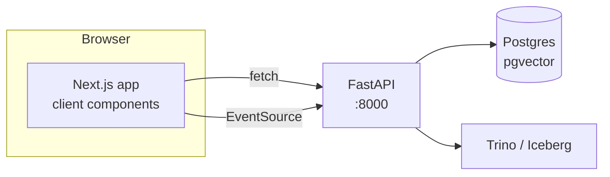

# Phase 8 — Next.js Dashboard

**Status:** planned, not started · **Written:** 4 Sep 2026 · **Estimate:** ~4–6 evenings
(up from the blueprint's 3–4 — two required backend additions found below)

The blueprint's one-liner: *"Four screens: proposal list with protocol and status filters;
proposal detail with the risk panel; chat with streaming and clickable citations; and a
version-history timeline for a single proposal."* That's still the right shape. This
document exists because three things have changed since that line was written — real data
now exists to check it against, and checking it against `backend_api`'s actual code (not the
plan's assumption of what `backend_api` would look like) surfaces gaps worth fixing before
frontend work starts, not after.

---

## Three corrections to the blueprint, found by checking what's actually built

**1. The version-history screen has no backend endpoint to call.** Every existing route
(`/proposals/{id}`, and the SQL template it uses) filters `WHERE is_current` — by design, for
every other screen. Nothing today returns a proposal's *other* versions. This is the one
screen the blueprint calls "worth building carefully" because it's the only place SCD2
becomes visible to a reviewer — and it currently has zero data behind it. Needs one new SQL
template (`get_proposal_history`, dropping the `is_current` filter, ordering by `valid_from`)
and one new route (`GET /proposals/{id}/history`). Small, additive, not a redesign.

**2. The "risk panel" was never backed by a real signal.** No phase before this one computes
risk, and Phase 9 (contract source) and Phase 10 (alerting) — the phases that might have
produced one — don't exist yet either. Grepping the whole repo for "risk" turns up nothing
but incidental prose. Rather than block on a scoring model that doesn't exist, or silently
invent one during implementation, this plan defines the risk panel now as three simple,
explainable heuristics computed from columns silver already has: quorum not met, a
closer-than-typical vote margin, and turnout below a flagged threshold. Real signal, honestly
scoped — not a placeholder for a model that was never built.

**3. `get_proposal` doesn't select the columns the risk panel needs.** `quorum`, `choices`,
and `scores` are all real columns in `iceberg.silver.proposal_versions` (visible in
`build_silver.py`'s own `PROPOSAL_COLUMNS`) — none of them are in `get_proposal`'s `SELECT`
or in `ProposalDetail`. Also missing: `discussion_url`, needed for a "view forum thread" link
on the detail screen. This is a one-line addition to an existing template, not new plumbing.

None of these are big — a new template, a new route, a wider `SELECT` — but they're backend
work, not frontend work, and doing them first means the dashboard is never built against data
that doesn't exist yet.

---

## What already exists that this builds on

| Layer | What's there | What it means for this phase |
| --- | --- | --- |
| `POST /api/v1/chat` | one-shot question → answer + citations | the simple path; works with a plain form |
| `GET /api/v1/chat/stream` | Server-Sent Events, **one event per completed graph node** (`router`, `retrieval`, `synthesis`...) | **not** token-by-token prose streaming — see below |
| `GET /proposals`, `GET /proposals/{id}` | list + current-state detail, via the same SQL templates the agent's SQL node uses | reused as-is; `list_proposals`'s `limit` is capped at 100 server-side (see pagination note) |
| Citations (`chunk_ref`) | now genuinely unique per chunk, protocol-qualified | citations can safely deep-link — this wasn't true before today's addressing fix |
| Real corpus | 1,782 current proposals across 5 protocols, full Discourse history | list/detail/chat screens have real, full-scale data to run against, not a demo slice |
| Version history | **3 proposals with genuine multi-version history today** (one with 6 versions), confirmed by direct query | small, but real and non-zero — the timeline screen has something true to show right now, and this number only grows as the daily DAG keeps running |
| CORS | **not configured** in `backend_api/main.py` | required addition — a browser-based dashboard can't call the API without it |

**On the streaming distinction, because it shapes the whole chat screen's design:** the
`/stream` endpoint's own docstring is explicit that this is "the honest middle ground" — real,
asynchronous progress per graph node, not a typewriter effect over the answer's prose. The
dashboard's chat UI should show stage progress ("routing... retrieving... synthesizing...")
and then render the complete answer when the `synthesis` event arrives — not attempt a
character-by-character reveal that the backend doesn't actually produce. Building the UI
around a promise the API doesn't keep would be the kind of thing a technical reviewer
notices immediately.

---

## Architecture

**Direct client-side calls to FastAPI, no Next.js API-route proxy layer.** The delivery
layer's own stated design is "no auth anywhere... kept deliberately" — there is nothing for a
server-side proxy to broker yet (no session, no key to hide). Adding one now would be
plumbing for a problem Phase 12 (multi-tenant auth) is the actual right place to solve.
Requires: CORS middleware on `backend_api/main.py` allowing the dashboard's origin.

**Data fetching: plain `fetch` + React state, no query library.** Four screens, all simple
GETs plus one SSE stream — `TanStack Query` or similar would be real value at a much larger
surface area, but here it's a dependency earning nothing yet. One small custom hook for the
SSE chat stream (`EventSource`-based) is the only non-trivial data-fetching code this phase
needs.

**Styling: Tailwind.** Fast enough to reach a portfolio-quality result without a design
system to maintain. Not load-bearing — swap it if you'd rather use something else, nothing
else in this plan depends on the choice.

---

## Required backend additions (do these first)

1. **CORS middleware** in `backend_api/main.py`, scoped to the dashboard's dev origin
   (`localhost:3000`) and whatever it's deployed to later.
2. **`get_proposal_history` SQL template** (`ai_agent/graph/sql_templates.py`) — same
   `proposal_id` validation as `get_proposal`, drops `WHERE is_current`, adds
   `valid_from`, `valid_to`, `is_current`, `content_hash`, orders by `valid_from ASC`.
3. **`GET /proposals/{id}/history`** route + a `ProposalVersion` list schema.
4. **Widen `get_proposal`'s `SELECT`** to include `quorum`, `choices`, `scores`,
   `discussion_url` — and the matching fields on `ProposalDetail`.
5. **Pagination on `GET /proposals`.** At 1,782 current proposals and a 100-row server-side
   cap, a "browse all proposals" list screen genuinely cannot reach most of the corpus today.
   Add `offset` alongside the existing `limit` (both already validated the same way `limit`
   is) rather than just raising the cap — a real, if simple, pagination mechanism instead of
   a bigger arbitrary wall.

---

## The four screens

### 1. Proposal list

- **Data:** `GET /proposals?protocol=&state=&limit=&offset=`
- **Filters:** protocol dropdown (5 protocols), state dropdown (active/closed/pending),
  client-side text filter over the already-fetched page (no full-text search endpoint exists,
  and building one is out of scope here)
- **Interaction:** row click → detail screen; "Load more" advances `offset`
- **Exit criteria:**
  - Changing the protocol or state filter issues a new real API call with those exact query
    params — verified by checking the network request, not just the visible rows changing
  - At `protocol=aave`, the list can reach all 978 current Aave proposals via repeated "load
    more", not just the first 100
  - An empty result (a protocol/state combination with zero matches) renders a real empty
    state, not a blank screen or a loading spinner stuck forever

### 2. Proposal detail + risk panel

- **Data:** `GET /proposals/{id}` (widened per above)
- **Risk panel — defined concretely, not aspirationally:**
  - **Quorum flag:** `scores_total < quorum` (only shown when `quorum` is non-null)
  - **Close-vote flag:** the top two `choices` by `scores` are within a fixed margin (start
    at 5% of `scores_total`; this is a tunable constant, not a discovered one — say so in
    the code the way `DEFAULT_MAX_DISTANCE` says so)
  - **Low-turnout flag:** `vote_count` below a static per-protocol floor (a rough constant is
    fine for v1 — a real "vs. this protocol's historical median" comparison is a legitimate
    v2, not required here)
  - Each flag renders with the actual numbers that triggered it (e.g. "quorum not met: 42,100
    of 50,000 required") — a flag with no visible evidence is not trustworthy on a governance
    dashboard
- **Also shows:** a "view forum discussion" link when `discussion_url` is present
- **Exit criteria:**
  - At least one real proposal in the corpus visibly triggers each of the three flags —
    found by querying the corpus, not asserted from the UI alone
  - At least one real proposal triggers **none** of the flags, and the panel visibly says so
    rather than rendering nothing (an absent risk panel and a clean bill of health must look
    different)
  - The panel never fabricates a number — every flag's displayed evidence traces to a real
    column value, checkable against a direct query of the same proposal

### 3. Chat with streaming and clickable citations

- **Data:** `GET /api/v1/chat/stream` as the primary path (progress staging), `POST
  /api/v1/chat` as the simple fallback if SSE proves not worth the added complexity
- **UI:** visible stage progress as graph-node events arrive; full answer rendered on
  `synthesis`; citation markers (`[c0]`, `[c1]`...) rendered as clickable chips
- **Citation click behavior, decided explicitly rather than left ambiguous:**
  - `source: proposal` → navigates to that proposal's detail screen (screen 2)
  - `source: forum` → no detail screen exists for forum topics in this phase's scope; renders
    an inline expandable snippet (protocol, title, distance, the cited text) rather than a
    broken or fabricated link
- **Exit criteria:**
  - A real question against the live corpus produces visible stage progress before the final
    answer appears — not a blank wait, and not a fake progress bar unconnected to real events
  - Every citation marker in a rendered answer resolves to something on click — no marker
    that does nothing, matching the backend's own "a fabricated citation fails a lookup"
    discipline extended to the UI layer
  - A genuinely unanswerable question (one of the eval set's negatives) renders the
    `data_gap` response honestly, not as an empty or broken-looking screen

### 4. Version-history timeline — the screen this phase exists to prove out

- **Data:** `GET /proposals/{id}/history` (new)
- **UI:** a vertical timeline, one entry per SCD2 version, each showing its
  `valid_from → valid_to` window (open-ended for the current version) and what changed
  from the previous version — a structured diff of `proposal_state`, `vote_count`, and
  `scores_total` is enough for v1; a full text diff of `body` is a legitimate later
  enhancement, not required here
- **Exit criteria:**
  - Loading the real 6-version proposal (`0xe7ce2a6c...`, Aave) renders all 6 versions in
    order, with visibly different `vote_count`/`scores_total` between at least two of them —
    this is the single most important check in this whole phase, because it's the literal
    proof that the SCD2/lakehouse work is real and not asserted
  - A single-version proposal (the overwhelming majority of the corpus) renders one entry and
    says plainly that this is its only known version — not an empty timeline, not an error
  - Every rendered version's `valid_from`/`valid_to` is checkable against a direct Trino query
    of the same proposal_id with no `is_current` filter

---

## Build order

1. Backend additions (CORS, `get_proposal_history` + route, widened `get_proposal`,
   `offset` pagination) — verified with `curl`/`httpie` before any frontend code exists
2. Next.js scaffold, proposal list screen against the real, paginated API
3. Proposal detail + risk panel, checked against the specific known-flagged and
   known-clean proposals named above
4. Version-history timeline, checked against the specific known 6-version proposal
5. Chat screen last — it's the most complex UI (SSE, citation resolution) and benefits from
   the other three screens' data-fetching patterns already being proven out

---

## How we'll know it works — status against this plan's own criteria

| Exit criterion | How it's checked |
| --- | --- |
| No mocked data anywhere (the blueprint's own bar) | every screen's data traces to a real, running API call, checkable via the browser's network tab |
| Filters issue real, distinct API calls | verified per-filter, not just "the list looks different" |
| Full corpus reachable, not just first 100 | pagination reaches all 978 Aave proposals |
| Risk panel flags are evidence-backed | at least one flagged and one clean real proposal, numbers checkable against direct queries |
| Citations always resolve | no dead citation marker in any rendered answer |
| Version timeline shows real SCD2 history | the known 6-version proposal renders correctly, cross-checked against Trino directly |

---

## Cost

| Item | Notes |
| --- | --- |
| Local infrastructure | $0 — Next.js dev server alongside the existing stack |
| Real data used | already harvested and embedded (Phase 7); no new harvesting or embedding cost |
| Chat screen usage | same per-question OpenAI cost as `gov ask` already has — no new cost driver |

## Risks

| Risk | Severity | Mitigation |
| --- | --- | --- |
| Risk panel thresholds are arbitrary constants presented as authoritative | Medium | Document them as tunable, not discovered, in the code itself — same discipline `DEFAULT_MAX_DISTANCE` already models |
| Version-history screen looks broken if the demo proposal changes protocol data later | Low | The exit criterion names a specific real proposal id, but the check itself (multi-version rendering, diff correctness) is what matters — any multi-version proposal validates it |
| SSE proves fragile in the browser (reconnects, dropped events) | Low–Medium | `POST /api/v1/chat` is kept as an explicit fallback path, not removed once streaming works |

## What this phase does *not* do

No forum-topic detail screen (citations to forum content stay inline, not a full page). No
real-time updates (a proposal's data is as fresh as the last DAG run, not live). No
authentication (Phase 12). No contract-source or alerting integration (Phases 9–10 don't
exist yet). No deployment (this runs against the local API; a public URL is Phase 11).
